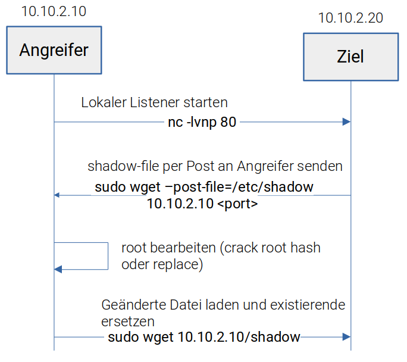

# wget

## Beschreibung

## SUDO Priv Escalation

Wenn wget in sudo -l aufgeführt wird, können Dateien per root transferiert werden.

Manche können nicht geholt werden wenn keine Leseberechtigung vorhanden ist! bspw /etc/sudoers/

* Wird php auf dem Webserver ausgefüllt, kann eine php-shell im webroot hinterlegt werden.
* Es kann aber auch per --post-file eine Datei auf den Angreifer geladen werden und wieder zur Aktualisierung zurück geladen werden.

<figure><figcaption></figcaption></figure>

## Parameter

\--spider : prüft ob vorhanden ohne herunterzuladen

