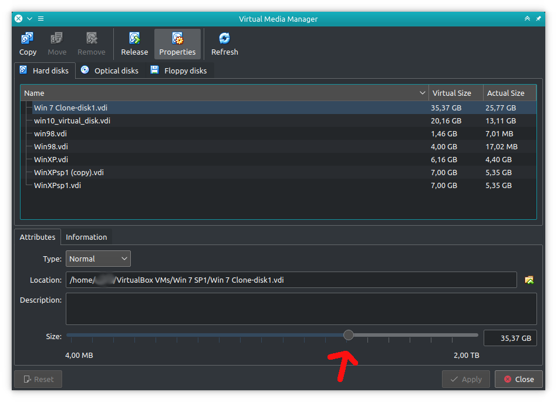

# Virtualbox

<details>

<summary>Schwachstellen/Exploits</summary>

[https://github.com/google/security-research/security/advisories/GHSA-qx2m-rcpc-v43v](https://github.com/google/security-research/security/advisories/GHSA-qx2m-rcpc-v43v)

</details>

## Partition vergrößern

<details>

<summary>Links:</summary>

[https://askubuntu.com/questions/88647/how-do-i-increase-the-hard-disk-size-of-the-virtual-machine](https://askubuntu.com/questions/88647/how-do-i-increase-the-hard-disk-size-of-the-virtual-machine) (Erweitern der Festplatte nach Anleitung des Kommentars von zitrax)

</details>

### Falls VirtualBox ≥ Version 6 verwendet wird:

1. Öffnen der GUI zum Resizen durch: File -> Virtual Media Manager (v6) oder\
   Tools -> Media (v7)
2. Festplatte selektieren und auf Properties (Eigenschaften) klicken
3. Den Slider verschieben um die Größe anzupassen



4. Nach dem Start des Systems muss der neue Speicher noch innerhalb der virtuellen Maschine zugewiesen/ angepasst werden.\


**4.1 LINUX**

```
# Partition vergrößern
sudo parted /dev/sda resizepart 3 42GiB
sudo partprobe

# PV aktualisieren
sudo pvresize /dev/sda3

# LV erweitern
sudo lvextend -l +100%FREE /dev/ubuntu-vg/ubuntu-lv

# Dateisystem anpassen
sudo resize2fs /dev/ubuntu-vg/ubuntu-lv

# Speicherplatz prüfen
df -h
```

4.2 WINDOWS

```
1. Computer Management -> Storage -> Disk Management (Win10:create
and format hard disk partitions)
2. Partition auswählen -> Rechtklick -> Extend Volume
3. Wizard -> ... -> Profit?
```
