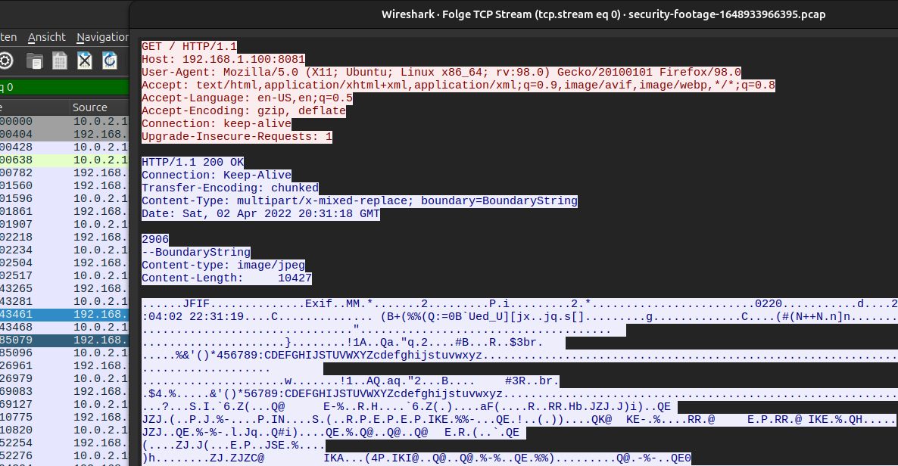

# SecurityFootage

Es wurde eine Datei security-footage-16..pcap bereitgestellt. Diese enthält einen Datenstream aus JPEG-Bildern.

<figure><figcaption>
Datenstrom (ASCII)
</figcaption></figure>

Diese wurden in Rohdaten umgewandelt und in Datei Datastream.dat exportiert.

<figure><figcaption>
Datenstrom (raw)
</figcaption></figure>

Da es sich nur um eine Folge von jpegs in einem http-Datenstrom handelt, kann schnell ein Extraktor gebaut werden. Dieser prüft ob es sich tatsächlich um ein Bild (Mime) handelt und lädt darauf alle jeweiligen Bytes, erstellt die Bilder und speichert sie unter fortlaufender Nummer in einem Ausgabeordner.

Zur schnellen Analyse und Prüfung wurde ebenso ein graphischer Videoplayer mit einfacher Funktionalität wie Änderung der FPS und Abspielrichtung, Start und Stopp sowie die Anzeige der wichtigsten Dateiinformationen (u.a. Name, Größe, md5- und sha256-hash, exif), implementiert.

<figure><figcaption>
Einfacher Videoplayer
</figcaption></figure>

Github:

Extrahierter Datenstream: [https://github.com/shift000/hackpack/blob/main/Datastream.dat](https://github.com/shift000/hackpack/blob/main/Datastream.dat)

Extraktor/JPEG-Viewer: [https://github.com/shift000/hackpack/blob/main/Datastream\_Extractor\_and\_Viewer.py](https://github.com/shift000/hackpack/blob/main/Datastream_Extractor_and_Viewer.py)

requirements.txt: [https://github.com/shift000/hackpack/blob/main/ds\_requirements.txt](https://github.com/shift000/hackpack/blob/main/ds_requirements.txt)

